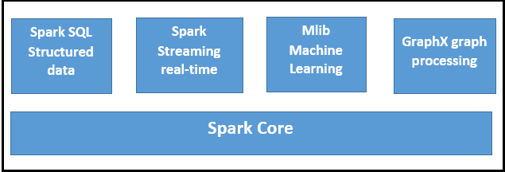
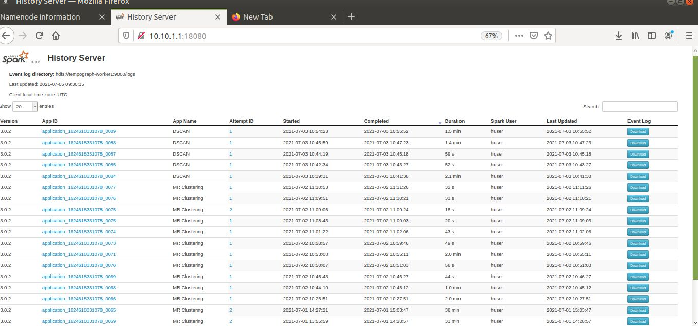

# Configure pache Spark on Top of a YARN Cluster manager


This guide present how we can install and configure Apache Spark on cluster of machines using YARN cluster manager.  Firstly, an overview about apache spark will be presented in order to understand the main features of this software, and global architecture will be presented.
This guide present how we can install and configure Apache Spark on clusters of machines using YARN cluster manager.  Firstly, an overview about apache spark will be presented in order to understand the main features of this software, and global architecture will be presented.

Since the Spark configuration is on top of the Yarn cluster manager, we advise you to have a look at this lab. in order to configure your yarn cluster before starting this lab.
https://github.com/inoubliwissem/HadoopCluster 
## Apache Spark: an overview
### What is Spark?
Apache Spark is one of the most popular open-source  in-memory and distributed computing platforms for  batch and stream processing.  It was originally designed at the University of California at Berkeley in 2009.
Since its release, Apache Spark, the uin-memory analytics engine, has seen rapid adoption by companies across various industries. Critical internet players such as Netflix, Yahoo and eBay have deployed Spark on a massive scale applications  on clusters of over 8,000 nodes. This open-source community quickly became the largest in the big data world with over 1,000 contributors from over 250 organizations.

Apache Spark represent the enxt generation of the big data framework, wich is mainly deseigned to  reduce the  Data Shuffling step in the MapReduce framework.
### Apache Spark Ecosystem
Spark  provides high-level API in Java, Scala , Python, and R and provides a new data structure that is alled Resilient Distributed Datasets (RDD)  and represent the key advantage of this engine. On top of RDD Spark build its core and an ecosystem that based on this core. The following figure shows the spark ecosystem:


1)  **Core Spark** Core is the underlying general execution engine for spark platform that all other functionality is built upon. It provides In-Memory computing and referencing datasets in external storage systems.

2) **Spark SQL** Spark SQL is a component on top of Spark Core that introduces a new data abstraction called SchemaRDD, which provides support for structured and semi-structured data.

3) **Spark Streaming** Spark Streaming leverages Spark Core's fast scheduling capability to perform streaming analytics. It ingests data in mini-batches (called Dstream) and performs RDD transformations on those Dstream of data.

4) **MLlib (Machine Learning Library)** MLlib is a distributed machine learning framework above Spark because of the distributed memory-based Spark architecture.

5) **GraphX** GraphX is a distributed graph-processing framework on top of Spark core. It provides an API for expressing graph computation that can model the user-defined graphs by using Pregel abstraction API. It also provides a GrapheFrame representaion that based on a Triblet data structure.

### Spark Architecture
like Apache hadoop, Spark also   is based on muli-nodes  and  Master/Slaves  architecture. it has a basic cluster manager (standalone) and can be deployed with other exiting cluster manager (YARN, MESOS).
Apache Spark has a well-defined layered architecture where all the spark components and layers are deployed on master or slave machine. The next figure ullistrate the global rachitecture of Spark:

As it's presented in the previous figure Spark architecture is based on tow node types: master and worker, and diffrent componants or services are used by spark. In the next, we try to present these elements:
1) **Driver programm**  The process running the main() function of the spark application and creating the SparkContext that represent the main object of a spark application.
2) **SparkContext** is the entry point of any spark application that connect spark application with cluster, and used to create and manage RDDS in a spark application.
3)  **Cluster manager**   is an external service for acquiring management resources on the cluster (e.g. standalone manager, Mesos, YARN)
4) **Worker node**  any node that can run application code in the cluster, it is a slave machine
5) **Executor**  is an application container can be launched for an application on a worker node, each worker node can manage several executors. An executor is responsible fo  running tasks and keeps data in memory or disk storage across them.
6) **Task**  is an unit of work that will be sent to one executor, task be map, reduce, groupby ... functions.

## Configuration
In this lab we try to setup apche spark on top of Yarn cluster manager. For we start by a Yarn configuration and after that we set up some configuration related to apache spark.
1) Yarn confuguartion (https://github.com/inoubliwissem/HadoopCluster)
2) Spark configuration
**Download and Install Spark Binaries**
```{r, engine='bash', count_lines}
wget https://d3kbcqa49mib13.cloudfront.net/spark-2.2.0-bin-hadoop2.7.tgz
tar -xvf spark-2.2.0-bin-hadoop2.7.tgz
mv spark-2.2.0-bin-hadoop2.7 spark
```
**Integrate Spark with YARN**
To communicate with the YARN Resource Manager, Spark needs to be aware of your Hadoop configuration. This is done via **HADOOP_CONF_DIR** environment variable. 
Edit the hadoop user profile **/home/huser/.profile** and add the following lines:

```{r, engine='bash', count_lines}
export HADOOP_CONF_DIR=/home/huser/hadoop/etc/hadoop
export SPARK_HOME=/home/huser/spark
export LD_LIBRARY_PATH=/home/huser/hadoop/lib/native:$LD_LIBRARY_PATH
```
Restart your session by logging out and logging in again.
Edit $SPARK_HOME/conf/spark-defaults.conf and set **spark.master** to yarn:
```{r, engine='bash', count_lines}
nano $SPARK_HOME/conf/spark-defaults.conf
```
```{r, engine='bash', count_lines}
**spark.master yarn**
```
Edit **$SPARK_HOME/conf/spark-defaults.conf** and add the following lines to enable Spark jobs to log in HDFS:
```{r, engine='bash', count_lines}
spark.eventLog.enabled true
spark.eventLog.dir hdfs://master:9000/spark-logs
```
Create the log directory in HDFS
```{r, engine='bash', count_lines}
hdfs dfs -mkdir /spark-logs
```
Configure History Server related properties in **$SPARK_HOME/conf/spark-defaults.conf**:
```{r, engine='bash', count_lines}
spark.history.provider org.apache.spark.deploy.history.FsHistoryProvider
spark.history.fs.logDirectory hdfs://master:9000/spark-logs
spark.history.fs.update.interval 10s
spark.history.ui.port 18080
```
Run the History Server:
```{r, engine='bash', count_lines}
$SPARK_HOME/sbin/start-history-server.sh
```
Access the History Server by navigating to http://master:18080 in a web browser:

